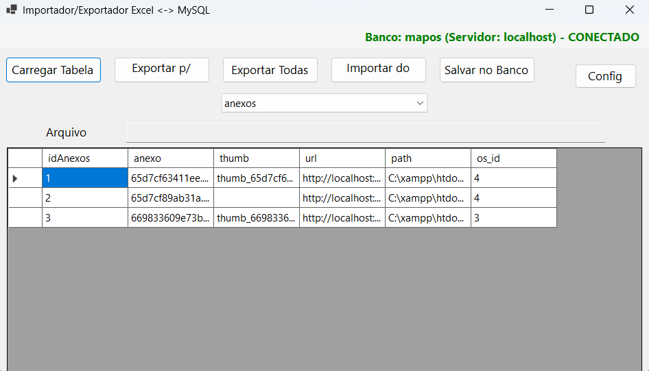
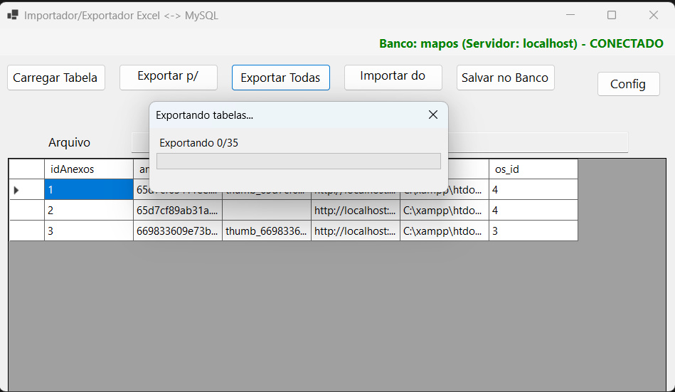

# ExcelImporter

Ferramenta WinForms para importar e exportar tabelas de um banco MySQL para arquivos Excel (.xlsx).

## Funcionalidades
- Importa dados de arquivos Excel para o banco MySQL.
- Exporta uma tabela selecionada para Excel.
- Exporta **todas** as tabelas do banco para uma pasta, cada uma em seu arquivo `.xlsx`.
- Exibe status da conexão, barra de progresso e mensagens amigáveis.

## Como usar

### 1. Configuração do Banco
Abra o programa e clique em **Config** para definir a string de conexão do MySQL (App.config).

### 2. Importação
- Clique em **Importar do Excel** e selecione um arquivo `.xlsx`.
- Escolha a tabela de destino e clique em **Salvar no Banco**.

### 3. Exportação
- Para exportar uma tabela, selecione-a e clique em **Exportar p/ Excel**.
- Para exportar **todas** as tabelas, clique em **Exportar Todas**. Escolha a pasta de destino e aguarde o progresso.

### 4. Status
O status da conexão aparece no topo, em verde (conectado) ou vermelho (falha).

## Build/Requisitos
- .NET 9.0 ou superior
- MySQL Server
- Pacotes: ClosedXML, MySql.Data

### Build e Executável Único
Para gerar um `.exe` único:
```sh
dotnet publish -c Release -r win-x64 -p:PublishSingleFile=true --self-contained true -p:IncludeAllContentForSelfExtract=true -p:PublishTrimmed=false
```
O executável estará em `bin/Release/net9.0-windows/win-x64/publish/ExcelImporter.exe`.

## Interface do Sistema

### Tela Principal


- Mostra os botões principais: Importar do Excel, Exportar p/ Excel, Exportar Todas, Salvar no Banco, Config.
- Exibe status de conexão (verde/vermelho) e seleção de tabela.

### Progresso de Exportação


- Barra de progresso indicando exportação de todas as tabelas.
- Mensagem mostra qual tabela está sendo exportada.

---

## Publicação no GitHub

1. **Clone ou crie o repositório:**
   ```sh
   git init
   git add .
   git commit -m "Primeiro commit do ExcelImporter"
   git remote add origin https://github.com/seuusuario/ExcelImporter.git
   git push -u origin master
   ```
2. **Inclua prints reais em `docs/`**
   - Substitua `docs/layout.png` e `docs/export_progress.png` por prints reais da aplicação rodando.
3. **Use o `.gitignore` já incluso** para evitar arquivos desnecessários no repositório.

---

## Dúvidas?
Abra uma issue no repositório ou consulte este README!

## Recomendações para o GitHub
- Não suba as pastas `bin/`, `obj/`, nem arquivos de configuração sensíveis.
- Inclua este README.md e as imagens de tela na pasta `docs/`.

---

**Dúvidas ou sugestões? Abra uma issue!**
